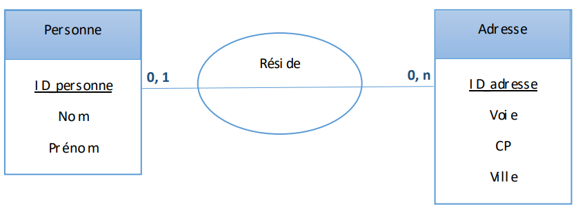
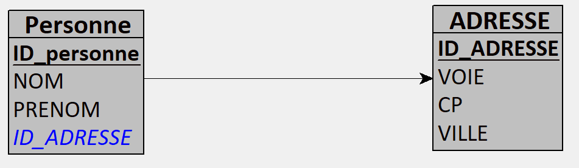
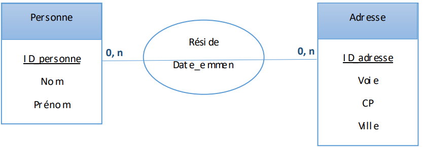
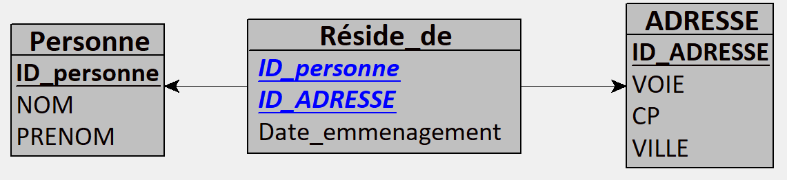
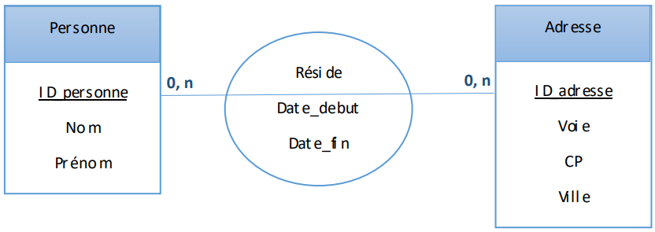
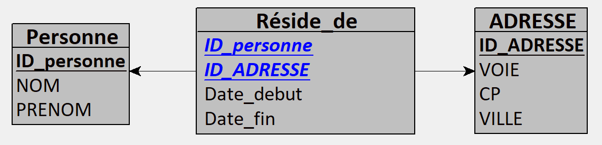

# WS Prosit 1: Archi - Ritter Antoine

## Introduction

Suite aux activités faites lors des séquences de préparation du bloc “ Big Data”, vous avez été rappelé aux notions liées aux bases de données relationnelles qui sont liées aux systèmes OLTP (traitement transactionnel en ligne) pour les bases de données opérationnelles/transactionnelles. 

Afin de pouvoir modéliser un datawarehouse/datamart (entrepôt de magasin de données), vous êtes amenés à utiliser les systèmes OLAP (traitement analytique en ligne) et à modéliser des données dimensionnelles/de rapport en manipulant des tables de faits et des tables de dimensions selon différents contextes. Un passage des différents modèles de données est important également pour une bonne implémentation de données.

## Exercice 1

Dans le but de maîtriser le passage d’un modèle conceptuel (ou modèle entité-association) à un modèle logique de données, on demande de conclure les modèles logiques de données à partir des modèles conceptuels suivants :

1. Modèle 1:

[WS_M1.lo1](Exercice_1/WS_M1.lo1)

[WS_M1.loo](Exercice_1/WS_M1.loo)

1. Modèle 2:

[WS_M2.lo1](Exercice_1/WS_M2.lo1)

[WS_M2.loo](Exercice_1/WS_M2.loo)

1. Modèle 3:

[WS_M3.lo1](Exercice_1/WS_M3.lo1)

[WS_M3.loo](Exercice_1/WS_M3.loo)

# Exercice 2

Considérons le contexte suivant :

> Soit ERAX une entreprise industrielle qui stocke des produits dans différents points de stockage. Lors de l’achat d’un ou plusieurs produits, les employés d’ERAX font enregistrer les clients afin de pouvoir bénéficier des promotions dans le temps.
> 
1. A l’aide des notions de “Table de fait” (les données qui peuvent être mesurées) et de “Table de dimension” (ce qui est stocké), présenter une modélisation dimensionnelle en étoile qui aidera à mesurer les données.
2. Apportez les changements nécessaires au modèle déjà proposé afin de le rendre modèle en flocon.
3. Citer les principales avantages et inconvénients des deux modèles.

Indication : 

nous aimerions analyser dans le temps, les quantités vendues ainsi que les coûts associés pour chaque produit lié au client qui l’a acheté et dans chacun des magasins avec la promotion associée.

Données :

Nom de la promotion, Type du prix, Nom magasin, Adresse_magasin, Libellé_produit, Marque Groupe_produit, Nom_client, Prénom, Adresse_client, Profile_client, Pays, Nom région, nom_employé, mail_employé….

# Exercice 3

Considérons le contexte suivant :

> « Durant les vacances d’été, Thierry voyagera à l’étranger. Par l’occasion, il souhaite réserver une chambre dans un hôtel. Il a fait une recherche et il s’est rendu compte que les options envisagées caractérisent les hôtels qui ont un bon classement en terme d’étoiles. Ces hôtels font généralement partie d’une chaîne hôtelière. Certes, les caractéristiques recherchées peuvent être trouvés dans plusieurs hôtels. Toutefois, il n’y a forcément pas de disponibilités de chambres. Par ailleurs, le tarif journalier du type de chambres envisagées est au-delà de la compétence financière de Thierry. En effet, le tarif appliqué dépend du type de la chambre ainsi que de la date de réservation. En conséquence, Thierry a décidé de réserver une chambre avec les caractéristiques souhaitées, mais en réduisant la période de résidence. »
> 
1. Extraire des règles métiers à partir de la description du contexte.
    - Les hôtels doivent avoir un bon classement en termes d'étoiles.
    - Les hôtels peuvent faire partie d'une chaîne hôtelière.
    - La réservation d'une chambre dépend de la disponibilité des chambres dans les hôtels sélectionnés.
    - Le tarif journalier des chambres envisagées doit être comparé à la capacité financière de Thierry.
    - Le tarif appliqué dépend du type de chambre choisi par Thierry.
    - Le tarif appliqué dépend également de la date de réservation effectuée par Thierry.
    - Si le tarif dépasse le budget, Thierry peut ajuster la durée de son séjour pour rendre la réservation financièrement viable.
2. Proposer un modèle dimensionnel logique de données (assez complet) du magasin de données concernant les revenus de l’hôtel

# Exercice 4

Afin de faciliter l’implémentation des données dans le contexte précédent « Réservation des hôtels », définissez son modèle physique de données.

# Exercice 5

Afin d’observer son activité de vente sur les différents lieux de distribution, l’entreprise de fabrication de meubles YY souhaite mettre en place un système d’information décisionnel sous la forme d’un data mart. Ces lieux de distribution sont renseignés par leur enseigne, surface, adresse, département et région. Les ventes se décline en période de mois, d’année et de semestre. Elles aussi sont observées par leur type selon le nombre d’articles, et le chiffre d’affaire.

1. Construire le modèle en étoile de ce data mart indiquant le fait à observer, les axes d’analyse, ainsi que les mesures.
2. Etendre le modèle construit afin d’avoir un modèle en flocon.

# Exercice 6

1. Dans le but d’analyser les ventes d’une entreprise industrielle donnée, créer un modèle en flocon qui permet de mesurer les ventes à partir des quantités vendues et aux bénéfices, en fonction des ventes réalisées par jour, dans un magasin donné, pour un produit donné. Ce modèle doit nous permettra de pouvoir analyser les ventes par jour, par semaine, par mois et par année. Les magasins peuvent être classés selon leur ville et leur pays.
2. En réduisant la granularité des hiérarchies des dimensions représentant le temps et la localisation des magasins, déduire le modèle en étoile qui permet d’analyser les ventes pour cette entreprise.
3. Dans le but de mesurer le nombre de commandes qui est donné par jour et par magasin, étendre le modèle en flocon précédent en un modèle de constellation (ajouter une table de fait nommée « Vente-jour »).

---

Suite :

Vous aurez noté que l’objectif de ce ws est d'appréhender une modélisation dimensionnelle selon
différents contextes. Cette modélisation pourrait être faite en étoile, en flacon, et en constellation.
NB. N’oubliez pas que ces modélisations ont des fins analytiques et puis décisionnelles.

# Définitions

## Table de Fait

Une table de fait contient les mesures ou les données quantitatives d'un processus métier. Ces mesures sont généralement des valeurs numériques qui peuvent être agrégées, comme les ventes, les revenus, les coûts, etc. La table de fait capture les transactions ou les événements qui se produisent dans le cadre des activités de l'entreprise.

**Caractéristiques principales :**

- **Mesures** : Les colonnes principales sont des mesures numériques (ex. : nombre de ventes, montant des ventes, coût total, etc.).
- **Granularité** : Chaque ligne de la table de fait correspond à une instance de l'événement le plus granulaire à capturer (ex. : une ligne peut représenter une vente individuelle).
- **Clés étrangères** : La table de fait contient des clés étrangères qui référencent les tables de dimension, permettant de décrire le contexte des faits.

## Table de Dimension

Une table de dimension contient les attributs ou les descriptions qualitatives liées aux mesures enregistrées dans la table de fait. Les dimensions fournissent le contexte des faits en ajoutant des informations supplémentaires comme le produit, le client, le temps, la région géographique, etc.

**Caractéristiques principales :**

- **Descriptive** : Contient des données qualitatives et descriptives (ex. : noms de produits, catégories, noms de clients, etc.).
- **Clés primaires** : La table de dimension a une clé primaire unique pour chaque ligne qui correspond à une clé étrangère dans la table de fait.
- **Granularité** : Les tables de dimension sont généralement moins granulaires que les tables de fait et fournissent des informations de contexte plus riches.

## Différence entre une Table de Fait et une Table de Dimension

- **Nature des Données** :
    - **Table de Fait** : Contient des données quantitatives et transactionnelles (mesures).
    - **Table de Dimension** : Contient des données qualitatives et descriptives (attributs).
- **Structure** :
    - **Table de Fait** : Possède généralement plusieurs clés étrangères reliant les dimensions et des colonnes de mesures.
    - **Table de Dimension** : Possède une clé primaire unique et des colonnes d'attributs descriptifs.
- **Usage** :
    - **Table de Fait** : Utilisée pour les analyses et les rapports quantitatifs, permettant de calculer des totaux, des moyennes, des sommes, etc.
    - **Table de Dimension** : Utilisée pour filtrer, regrouper, et segmenter les données dans les analyses, en fournissant le contexte nécessaire pour interpréter les mesures.

### Exemple

**Table de Fait (FaitsVentes) :**

| ID_Vente | Date_Key | Produit_Key | Client_Key | Quantité | Montant |
| --- | --- | --- | --- | --- | --- |
| 1 | 20230101 | 1001 | 2001 | 2 | 300 |
| 2 | 20230102 | 1002 | 2002 | 1 | 150 |

**Table de Dimension (DimProduit) :**

| Produit_Key | NomProduit | Catégorie |
| --- | --- | --- |
| 1001 | Stylo | Papeterie |
| 1002 | Classeur | Bureau |

**Table de Dimension (DimClient) :**

| Client_Key | NomClient | Région |
| --- | --- | --- |
| 2001 | Dupont | Paris |
| 2002 | Martin | Lyon |

Dans cet exemple, la table de fait `FaitsVentes` enregistre les ventes avec des mesures telles que `Quantité` et `Montant`, tandis que les tables de dimension `DimProduit` et `DimClient` fournissent des informations contextuelles sur les produits et les clients.

Comprendre ces deux concepts est essentiel pour structurer efficacement un entrepôt de données et réaliser des analyses décisionnelles pertinentes.